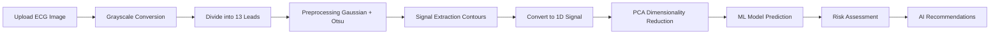

# 🫀 Silent Beat AI - Multilingual Cardiovascular Disease Detection System

[](https://streamlit.io/)
[](https://www.python.org/)
[](https://www.tensorflow.org/)
[](https://ai.google.dev/)

> An advanced AI-powered system for detecting cardiovascular diseases from ECG images with **multilingual support for 12 Indian languages**, featuring real-time analysis, personalized AI recommendations, and comprehensive Silent Myocardial Infarction (MI) risk assessment.

---

## 📋 Table of Contents

- [Overview](#overview)
- [Key Features](#key-features)
- [Multilingual Support](#multilingual-support)
- [Technology Stack](#technology-stack)
- [Installation](#installation)
- [Usage](#usage)
- [Project Architecture](#project-architecture)
- [Classification Categories](#classification-categories)
- [Dataset](#dataset)
- [How It Works](#how-it-works)
- [AI-Powered Recommendations](#ai-powered-recommendations)
- [Deployment](#deployment)
- [Documentation](#documentation)
- [Contributing](#contributing)

---

## 🌟 Overview

**Silent Beat AI** is a comprehensive cardiovascular disease detection system that combines advanced image processing, machine learning, and AI-powered personalized recommendations to analyze ECG images. The system is designed to be **accessible to everyone** by supporting 12 major Indian languages, making critical healthcare information available to 90%+ of India's population.

### What is Silent MI?

**Silent Myocardial Infarction (Silent MI)** is a heart attack with minimal or no symptoms. It's particularly dangerous because:
- 🚨 **No chest pain warning** - may feel like indigestion or fatigue
- 📊 **45% of heart attacks are silent**
- ⚠️ **Increases risk of future cardiac events**
- 💔 **Can cause permanent heart damage**

Our system helps detect and assess Silent MI risk through comprehensive ECG analysis.

---

## ✨ Key Features

### 🔬 Advanced ECG Analysis
- **13-Lead ECG Processing**: Comprehensive analysis of all standard ECG leads
- **Multi-Step Pipeline**: Grayscale conversion → Lead division → Preprocessing → Signal extraction → 1D conversion → PCA reduction
- **Real-Time Processing**: Live visualization of each processing step
- **High Accuracy**: Pre-trained ML models for precise classification

### 🌍 Multilingual Support
- **12 Indian Languages**: Complete UI and AI recommendations
- **Native Scripts**: All languages displayed in their authentic scripts
- **Inclusive Healthcare**: Making cardiac care accessible to all

### 🤖 AI-Powered Intelligence
- **Google Gemini Integration**: Personalized medical recommendations
- **Context-Aware Advice**: Tailored to diagnosis and risk level
- **Multilingual AI**: Recommendations in user's preferred language
- **Comprehensive Guidance**: Immediate actions, prevention, lifestyle, and long-term care

### 📊 Risk Assessment
- **Silent MI Risk Calculation**: Probability-based risk assessment
- **Risk Categories**: Low, Moderate, Moderate-High, High, Critical
- **Visual Indicators**: Color-coded results for quick understanding
- **Detailed Explanations**: Comprehensive risk factor information

### 🎯 User Experience
- **Interactive UI**: Modern, responsive Streamlit interface
- **Step-by-Step Visualization**: View entire processing pipeline
- **Expandable Sections**: Detailed views for technical users
- **Progress Tracking**: Real-time progress indicators
- **Emergency Information**: Critical warning signs in native language

---

## 🌐 Multilingual Support

### Supported Languages (12 Total)

| Language | Script | Native Name | Status |
|----------|--------|-------------|--------|
| English | Latin | English | ✅ Complete |
| Hindi | Devanagari | हिन्दी | ✅ Complete |
| Tamil | Tamil | தமிழ் | ✅ Complete |
| Telugu | Telugu | తెలుగు | ✅ Complete |
| Kannada | Kannada | ಕನ್ನಡ | ✅ Complete |
| Malayalam | Malayalam | മലയാളം | ✅ Complete |
| Bengali | Bengali | বাংলা | ✅ Complete |
| Marathi | Devanagari | मराठी | ✅ Complete |
| Gujarati | Gujarati | ગુજરાતી | ✅ Complete |
| Punjabi | Gurmukhi | ਪੰਜਾਬੀ | ✅ Complete |
| Urdu | Arabic | اردو | ✅ Complete |
| Odia | Odia | ଓଡ଼ିଆ | ✅ Complete |

### What's Translated?
- ✅ **Complete UI**: All buttons, labels, headings, and instructions
- ✅ **AI Recommendations**: Personalized medical advice from Gemini
- ✅ **Risk Information**: Prevention strategies and warning signs
- ✅ **Emergency Instructions**: Critical care information
- ✅ **Educational Content**: Understanding Silent MI and risk factors

---

## 🛠️ Technology Stack

### Core Technologies
- **Python 3.8+**: Main programming language
- **Streamlit**: Web application framework
- **OpenCV**: Image processing and computer vision
- **NumPy & Pandas**: Data manipulation and analysis
- **Scikit-learn**: Machine learning algorithms and PCA
- **Google Gemini 2.5 Flash**: AI-powered recommendations

### Machine Learning Pipeline
```
ECG Image → Preprocessing → Feature Extraction → PCA Reduction → ML Classification → Risk Assessment
```

### Image Processing Techniques
- RGB to Grayscale conversion
- Gaussian filtering
- Otsu thresholding
- Contour detection
- Signal extraction and normalization

---

## 📦 Installation

### Prerequisites
- Python 3.8 or higher
- pip package manager
- Git

### Step 1: Clone the Repository
```bash
git clone https://github.com/rameshavinash94/Cardiovascular-Detection-using-ECG-images.git
cd Cardiovascular-Detection-using-ECG-images/Deployment
```

### Step 2: Create Virtual Environment (Recommended)
```bash
# Windows
python -m venv venv
venv\Scripts\activate

# Linux/Mac
python3 -m venv venv
source venv/bin/activate
```

### Step 3: Install Dependencies
```bash
pip install -r requirements.txt
```

### Step 4: Run the Application
```bash
streamlit run final_app.py
```

The application will open in your default browser at `http://localhost:8501`

---

## 🚀 Usage

### Quick Start Guide

1. **Select Language**: Choose your preferred language from the sidebar dropdown
2. **Upload ECG Image**: Click "Browse files" and select an ECG image (PNG, JPG, JPEG)
3. **Wait for Analysis**: The system will automatically process the image through 8 steps
4. **View Results**: See diagnosis, risk assessment, and AI recommendations
5. **Read Recommendations**: Get personalized care plan in your selected language

### Supported Image Formats
- ✅ PNG (.png)
- ✅ JPEG (.jpg, .jpeg)
- 📏 Recommended: Clear, high-resolution ECG images

### Sample Images
Download sample ECG images from:
- [ECG Images Dataset](https://github.com/rameshavinash94/Cardiovascular-Detection-using-ECG-images/tree/main/ECG_IMAGES_DATASET)

---

## 🏗️ Project Architecture

### System Architecture Diagram


### Processing Pipeline



### Component Breakdown

| Step | Process | Output |
|------|---------|--------|
| 1 | Image Upload | Raw ECG image |
| 2 | Grayscale Conversion | Simplified image |
| 3 | Lead Division | 13 individual leads |
| 4 | Preprocessing | Filtered signals |
| 5 | Signal Extraction | Contour-based signals |
| 6 | 1D Conversion | Combined signal array |
| 7 | PCA Reduction | Optimized features |
| 8 | ML Prediction | Classification result |

---

## 🏥 Classification Categories

The system classifies ECG images into **4 distinct categories**:

### 1. ✅ Normal ECG
- **Description**: Healthy heart rhythm with no abnormalities
- **Risk Level**: Low (5-15%)
- **Recommendation**: Continue preventive care and annual checkups

### 2. ⚠️ Myocardial Infarction (Acute)
- **Description**: Active heart attack detected
- **Risk Level**: Critical (75-95%)
- **Recommendation**: **IMMEDIATE EMERGENCY CARE REQUIRED**

### 3. ⚠️ Abnormal Heartbeat (Arrhythmia)
- **Description**: Irregular heart rhythm patterns
- **Risk Level**: Moderate to High (40-65%)
- **Recommendation**: Cardiologist consultation within 1-2 weeks

### 4. ℹ️ History of Myocardial Infarction
- **Description**: Previous heart attack indicators
- **Risk Level**: Moderate (30-50%)
- **Recommendation**: Ongoing cardiac monitoring and medication

---

## 📊 Dataset

### Source
**Mendeley Data**: [ECG Images Dataset](https://data.mendeley.com/datasets/gwbz3fsgp8/2)

### Dataset Composition

| Category | Images | Total Leads (×12) | Description |
|----------|--------|-------------------|-------------|
| Normal | 284 | 3,408 | Healthy individuals |
| Myocardial Infarction | 240 | 2,880 | Acute MI patients |
| Abnormal Heartbeat | 233 | 2,796 | Arrhythmia cases |
| History of MI | 172 | 2,064 | Previous MI patients |
| **Total** | **929** | **11,148** | - |

### Preprocessing Pipeline
1. **Image Collection**: 929 ECG images from 4 categories
2. **Lead Extraction**: Each ECG divided into 12 standard leads
3. **Signal Processing**: Gaussian filtering and thresholding
4. **Feature Engineering**: Contour-based 1D signal conversion
5. **Dimensionality Reduction**: PCA to optimize features
6. **Model Training**: Machine learning classification

---

## 🔍 How It Works

### Detailed Processing Steps

#### Step 1: Image Upload 📤
- User uploads ECG image through web interface
- Image validation and format checking
- Initial display of original ECG

#### Step 2: Grayscale Conversion ⚙️
- RGB to grayscale transformation
- Simplifies image for better signal extraction
- Reduces computational complexity

#### Step 3: Lead Division ✂️
- ECG divided into 13 standard medical leads
  - Leads I, II, III (Bipolar limb leads)
  - aVR, aVL, aVF (Augmented limb leads)
  - V1-V6 (Chest/precordial leads)
  - Long Lead 13 (Extended rhythm strip)

#### Step 4: Preprocessing 🔧
- **Gaussian Filtering**: Noise reduction
- **Otsu Thresholding**: Binary segmentation
- **Grid Removal**: Extract clean signals
- **Enhancement**: Signal quality improvement

#### Step 5: Signal Extraction 📈
- **Contour Detection**: Identify signal boundaries
- **Waveform Isolation**: Separate P, QRS, T waves
- **Background Removal**: Eliminate grid lines
- **Signal Refinement**: Clean waveform extraction

#### Step 6: 1D Conversion 🔢
- Convert 2D image signals to 1D arrays
- Combine all 13 leads into unified dataset
- Normalize and scale values
- Create feature matrix

#### Step 7: PCA Dimensionality Reduction 🧮
- **Principal Component Analysis**: Feature reduction
- **Optimization**: Retain critical information
- **Efficiency**: Improve model performance
- **Feature Selection**: Keep most relevant components

#### Step 8: ML Prediction & Risk Assessment 🤖
- **Classification**: Determine cardiac condition
- **Risk Calculation**: Silent MI probability
- **Confidence Score**: Model certainty
- **Result Generation**: Diagnosis and recommendations

---

## 🤖 AI-Powered Recommendations

### Google Gemini Integration

The system uses **Google Gemini 2.5 Flash** to generate personalized medical recommendations in the user's selected language.

### Recommendation Categories

1. **Immediate Actions** 🚨
   - What to do right now
   - Emergency procedures
   - First aid steps

2. **Prevention Strategies** 🛡️
   - How to prevent Silent MI
   - Risk reduction techniques
   - Lifestyle changes

3. **Lifestyle Modifications** 🏃
   - Diet recommendations
   - Exercise plans
   - Daily habits

4. **Medical Management** 💊
   - Suggested tests
   - Medication guidance
   - Doctor consultation topics

5. **Warning Signs** ⚠️
   - Symptoms to watch
   - When to seek help
   - Red flags

6. **Long-term Care** 📅
   - Follow-up schedule
   - Monitoring recommendations
   - Ongoing management

### Language-Specific AI
- AI recommendations are **entirely generated** in the selected language
- Uses native script for each language
- Culturally appropriate medical terminology
- Easy to understand for non-English speakers

---

## 🌐 Deployment

### Previous Deployment (GCP)
The application was previously deployed on **Google Cloud Platform**:
- **URL**: [https://cmpe255-project-q4uake3apq-uc.a.run.app](https://cmpe255-project-q4uake3apq-uc.a.run.app)

### Deployment Options

#### Option 1: Streamlit Cloud
```bash
# Push to GitHub
git push origin main

# Deploy via Streamlit Cloud
# Visit: https://share.streamlit.io/
```

#### Option 2: Docker Container
```dockerfile
FROM python:3.9-slim
WORKDIR /app
COPY requirements.txt .
RUN pip install -r requirements.txt
COPY . .
CMD ["streamlit", "run", "final_app.py"]
```

#### Option 3: Google Cloud Run
```bash
gcloud run deploy silent-beat-ai \
  --source . \
  --platform managed \
  --region us-central1 \
  --allow-unauthenticated
```

### Deployment Diagram


---

## 📚 Documentation

### Project Resources

- **📄 Abstract**: [Digitizing ECG Signals and Detection of Cardiovascular Diseases](https://github.com/rameshavinash94/Cardiovascular-Detection-using-ECG-images/blob/main/docs/Digitizing%20ECG%20signals%20and%20detection%20of%20Cardiovascular%20diseases.docx.pdf)

- **📊 Final Report**: [Complete Project Documentation](https://github.com/rameshavinash94/Cardiovascular-Detection-using-ECG-images/blob/main/docs/Final%20project%20submission.pdf)

- **🎬 Presentation**: [Project PPT on Canva](https://www.canva.com/design/DAEx1Se7iPs/Xy1tWQVcBt3Oww8hBHEvRg/view?utm_content=DAEx1Se7iPs&utm_campaign=designshare&utm_medium=link&utm_source=publishsharelink)

### Code Structure
```
Cardiovascular-Detection-using-ECG-images/
├── Deployment/
│   ├── final_app.py          # Main Streamlit application
│   ├── Ecg.py                 # ECG processing module
│   ├── requirements.txt       # Python dependencies
│   ├── Dockerfile             # Container configuration
│   └── model_pkl/             # Pre-trained ML models
├── ECG_IMAGES_DATASET/        # Sample ECG images
├── docs/                      # Documentation files
├── colabs/                    # Jupyter notebooks
└── README.md                  # This file
```

---

## 🤝 Contributing

We welcome contributions to improve Silent Beat AI! Here's how you can help:

### Areas for Contribution
- 🌍 Additional language translations
- 🧠 Model accuracy improvements
- 🎨 UI/UX enhancements
- 📖 Documentation updates
- 🐛 Bug fixes and testing

### Contribution Steps
1. Fork the repository
2. Create a feature branch (`git checkout -b feature/AmazingFeature`)
3. Commit your changes (`git commit -m 'Add AmazingFeature'`)
4. Push to the branch (`git push origin feature/AmazingFeature`)
5. Open a Pull Request

---

## 📜 License

This project is part of academic research. Please contact the repository owner for licensing information.

---

## 👥 Team

Developed as part of CMPE 255 - Data Mining course project.

---

## 📧 Contact & Support

For questions, suggestions, or support:
- 📫 Open an issue on GitHub
- 🌐 Visit the [project repository](https://github.com/rameshavinash94/Cardiovascular-Detection-using-ECG-images)

---

## 🙏 Acknowledgments

- **Mendeley Data** for providing the comprehensive ECG dataset
- **Google Gemini** for AI-powered multilingual recommendations
- **Streamlit** for the excellent web framework
- **Open-source community** for various libraries and tools

---

## ⚠️ Medical Disclaimer

**IMPORTANT**: This system is designed for educational and research purposes. It should **NOT** be used as a substitute for professional medical advice, diagnosis, or treatment. Always consult qualified healthcare professionals for medical decisions.

- 🚨 In case of emergency, call **108** (India) or your local emergency number immediately
- 💊 Never self-medicate based on AI recommendations
- 👨‍⚕️ Always verify results with certified cardiologists
- ⏰ Time is critical in cardiac emergencies - seek immediate help

---

<div align="center">

### 🫀 Made with ❤️ for Better Cardiac Healthcare

**Star ⭐ this repository if you find it helpful!**

</div>

**SAMPLE DEMO GIF**


cd "D:\projects clone\Cardiovascular-Detection-using-ECG-images\Deployment"; pip install -r requirements.txt

cd "D:\projects clone\Cardiovascular-Detection-using-ECG-images\Deployment"; streamlit run final_app.py